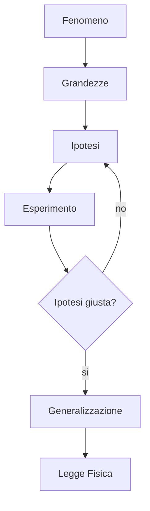

La fisica è la *scienza* che studia i **fenomeni naturali**, ne effettua **misure quantitative** per individuarne le **proprietà** e ne formula **leggi generali** che li governano.

Questo significa che i *dati sperimentali* sono la base della Fisica.
Misurare però ha come conseguenza l'introduzione di *errori*.
- Non considerati come sbagli ma come non conoscenza.

Ovviamente misurare deve essere fatto su *quantità misurabili*
> [!INFO] Esempio
> Il **calore** non può essere **misurato direttamente**, quindi la misura deve essere fatta tramite quantità misurabili.

Quindi effetivamente la misura **definisce** l' *oggetto fisico*. 
Questo **oggetto** viene definito dalle sue grandezze fisiche, che sono descritte da *grandezze matematiche* o addirittura tramite *procedimenti matematici*.
- Un esempio di questo è la velocità, dato che *non può essere* misurata direttamente, viene derivata da un *processo matematico*.

Le *grandezze matematiche* poi entrano nelle equazioni che esprimono **relazioni fisiche** o **leggi fisiche**.
Noi in quanto ingegneri dobbiamo fare **approssimazioni giuste**, dato che una precisione infinita nelle misure non può essere riportata nel progetto che viene realizzato.

Inoltre queste **equazioni** si combinano ottenendo delle nuove.
- Un incertezza all'inizio della catena **si propaga** e porta ad un risultato molto diverso.

### Piccole Nozioni Importanti (tm.)
Galilei diceva che la scienza "procede attraverso *"sensate esperienze e matematiche dimostrazioni"*.
Cosa significa?
Le osservazioni si effettuano tramite delle *misure* che forniscono dei numeri che vengono elaborati con **metodi matematici**.

Una **grandezza fisica** è una quantità alla quale, tramite la *misura* con uno strumento, associa un numero reale.

Un esempio più fondamentale di incertezza che introduciamo nella misura è l' *accuratezza* dello strumento di misura.
Se ho un righello che segna solo i *centimetri* non posso sapere il *millimetro* preciso in cui arriva l'oggetto che misuro.

~~dici "millimetro preciso in cui arriva l'oggetto che misuro" 5 volte velocemente.~~

Una lista non completa di tutti gli effetti che causano incertezza:
- Incompleta definizione del misurando
- Imperfetta realizzazione della definizione del misurando.
- Il campione misurato non rappresenta correttamente il misurando definito.
- Imperfetta o inadeguata conoscenza delle condizioni ambientali e dei loro effetti.
- Errore di lettura dello strumento.
- Risoluzione finita o soglia di discriminazione dello strumento.
- Valori inesatti dei campioni e dei materiali di riferimento.
- Valori inesatto di costanti e altri parametri che intervengono nell' analisi dei dati.
- Approssimazione e assunzioni che intervengono nel metodo e nella procedura.
- Variazioni in osservazioni ripetute.

Prendendo la lista possiamo fare alcune considerazioni:
Esistono due tipi di effetti:
**Effetti sistematici** di cui abbiamo il controllo dato che derivano dal *sistema di misura*.
**Effetti Casuali** che non possiamo controllare dato che influenzano il risultato per motivi *accidentali*.

La parte interessante anche matematicamente è la parte *casuale*, perché esiste una proprietà naturale dei fenomeni casuali:
Tendono ad avere una **distribuzione nota**!
Se inserisco i miei dati in un grafico posso essere relativamente sicuro che esiste *una misura* che capita con una frequenza maggiore.
Che significa? Che *purtroppo* dobbiamo affidarci alla **statistica**.
Sbabum formula matematica:
$$
\bar{x} = \sum_{i=1}^{N} \frac{x_{i}}{N}
$$
Questa formula mi dice che la media di molteplici misure mi danno un trend nella mia misura.

Se faccio quindi misure **infinite** posso creare un grafico che mi da intervalli sempre più piccoli, fino ad arrivare ad una **funzione continua**, che chiamiamo funzione **Gaussiana**.

L'integrale di questa funzione è uguale ad $1$. 
Mi sono perso??

All'interno della funzione abbiamo un bel parametro chiamato $\sigma$, che definiamo **deviazione standard**, che definisce quanto è grande la mia *gaussiana*. 
$\sigma$ è collegato alla precisione delle mie misure, dato che con una misura più *precisa*, l'**intervallo di misure** è inferiore, e quindi gli estremi sono **meno distribuiti** rispetto al centro.
$\sigma$ quindi è la *precisione* della mia misura.
Inoltre definisco la **deviazione standard** secondo questa formula:
$$
\sigma=\sqrt{ \sum_{i=1}^{N} \frac{\epsilon^{2}_{i}}{N} }
$$
Inoltre il mio $\epsilon$ lo definisco come $\epsilon_{i}=x_{i}-\bar{x}$. 

$\sigma$ rappresenta dal punto di vista *probabilistico* l'ampiezza attorno alla media per cui ho il 68% di probabilita che la prossima misura ne cada all'interno.

Questa quantità descrive **tutte** le fonti di *imprecisione casuale*.

L'errore è un componente **fondamentale** del mi *sistema di misura*.

Matematicamente possiamo dimostrare che l'integrale, cioè l'area sotto la funzione, della mia curva da $+/sigma$ a $-/sigma$ è uguale a circa il $68,3$% dell'area totale.
Ciò significa che tra le $N$ misure effettuate, una nuova misura ha il $68,3$% di probabilità di **cadere nell'intervallo** $\pm \sigma$.
Quindi $\sigma$ è connesso all'ampiezza delle mie misurazioni. Matematicamente dichiamo che:
$$
\int_{-\sigma}^{+\sigma} P(\epsilon) \, d\epsilon = 0,683
$$
Di conseguenza:
$$
\int_{-3\sigma}^{+3\sigma} P(\epsilon) \, d\epsilon = 0.99
$$
### Metodo Scientifico Sperimentale
Il nostro metodo scientifico è partito da *Galileo Galilei* che ha definito il **metodo scientifico**. che conosciamo sicuramente molto bene(tm.).

### Sistemi di unità di misura
- La scelta di un insieme di grandezze fisiche fondamentali e delle relative unità di misura definisce un **sistema di misura**.
- Vi è una certa *arbitrarietà* nella scelta di queste unità di misura.
- Si aggiornano le definizioni di queste unità rispetto alle *capabilities* della tecnologie di misura, per fare in modo di avere una *incertezza* minore possibile.
	- In genere rispetto alle tecnologie di **misura**.

Un esempio di definizione che cambia nel tempo è quella del *metro SI*, che durante i secoli si è evoluta dalla misura del **meridiani terrestri** fino a quella *odierna*.

Noi spesso useremo la **notazione scientifica** (ovviamente), quindi **impariamo ad usarla bene**.
Soprattutto la useremo rispetto all' **odrine di grandezza** degli oggetti misurati.