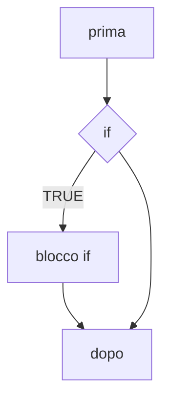
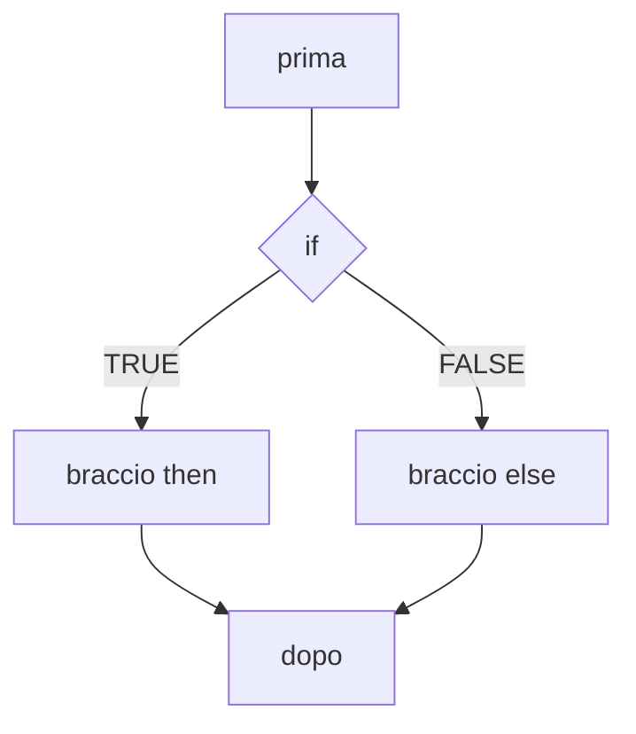
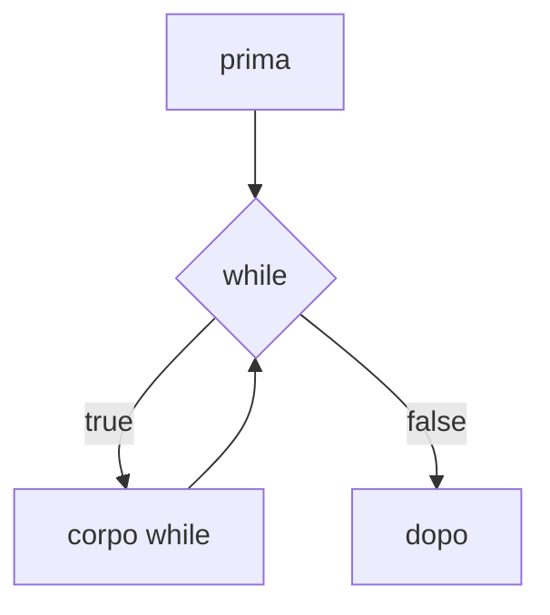
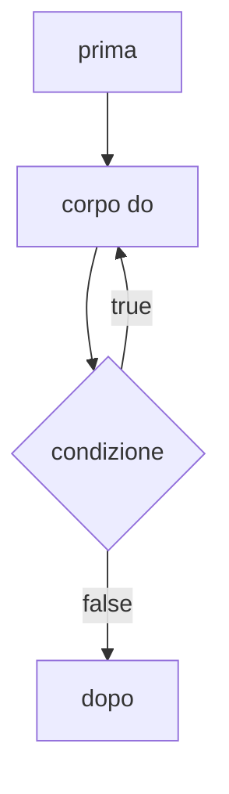
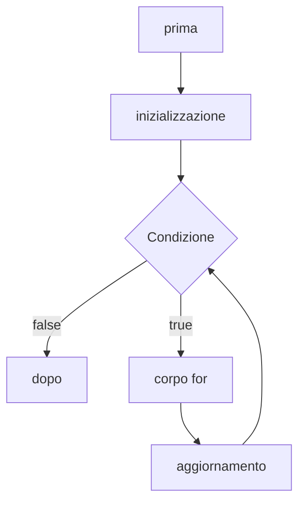

#università #programmazione #teoria 
Abbiamo a che fare con *paradigmi* che definiscono i modelli adottati da un certo linguaggio di programmazione.

In generale il nostro programma si definisce da *dati* e *flusso di controllo*.

Quindi per scrivere un programma abbiamo bisogno di solo tre costrutti:
- Strutture di sequenza.
- Strutture di selezione.
- Strutture di iterazione.

Per scrivere un programma in grado di eseguire diversi *flussi di esecuzione* rispetto ad alcune conduzioni.

### Controllo del flusso di esecuzione
Iniziamo a guardare il *costrutto di selezione* `if`.

Con il costrutto `if` il suo *corpo* viene eseguito **solo se** la condizione associata assume un valore `true`.  Altrimenti il corpo viene *saltato*.

La sintassi del costrutto `if` in [[C]] è:
```c
if (condizione){
	*corpo dell'if*
}
```

>[!exercise] Facciamo questo esercizio
>"Progetta e scrivi un programma che inserito un numero, se è maggiore di 10 lo stampa a video."
>![[if1.c]]

Il *flusso di esecuzione* quindi segue questo diagramma:


Nella versione base se la condizione è `false` l'esecuzione salta il corpo dell'*if*.
Per eseguire *blocco* nel caso della condizione falsa introduco il costrutto `if-else`.

I due *corpi*, data la natura bistabile del booleano, sono **mutualmente esclusivi**.

La sintassi del costrutto `if-else` in C è:
```c
if (condizione){
	*corpo if*
}
else{
	*corpo else*
}
```

>[!exercise] Facciamo questo esercizio
>"Progetta e scrivi un programma che inserito un numero intero, stampa a video se è maggiore oppure minore o uguale di 10
>![[ifelse1.c]]

Il *flusso di esecuzione* quindi segue questo diagramma:

Per evitare *indentazioni* eccessive posso usare una sintassi di questo tipo:
```c
if (condizione){
	*corpo if*
} else if (condizione2){
	*corpo else if*
} else{
	*corpo else else*
}
```

L'ultimo costrutto di selezione che dobbiamo vedere è il costrutto `switch-case`.
Questo costrutto fa la stessa cosa che facciamo con `if-else` ma in maniera diversa.
La sintassi è:
```c
switch(selettore){
	case cost1:
		*corpo*
		break;
	case cost2:
		*corpo*
		break;
	default:
		*finale*;
}
```

Lo `switch` calcola il valore dell'espressione `selettore` e rimanda lo svolgimento del programma al blocco con costante **uguale** al risultato.

>[!excercise] Facciamo questo esercizio

Ricordiamo che nello `switch case` i blocchi non sono mutualmente esclusivi.

#### Strutture di controllo iterative.
Con una struttura di controllo iterativa si *ripete l'esecuzione* di un blocco di istruzioni $n$ volte.

Costrutto `while`.

Nel costrutto `while` l'esecuzione del *corpo while* viene ripetuta finchè la **condizione** è `true`.
La sua sintassi è:
```c
while (condizione){
	<corpo while>
}
```
Dobbiamo ricordare che è necessara una **condizione di terminazione**, altrimenti l'esecuzione ripete infinitamente.

Il flusso di esecuzione è quindi:


>[!excercise] Facciamo questo esercizio
>Progettare e scrivere un programma che prenda in ingresso un numero intero n e stampi la tabellina del numero inserito.
>![[While1.c]]

Costrutto `do-while`.
Il costrutto è molto simile al costrutto `while`, ma esegue sempre il *corpo do*, prima di **valutare la condizione**.

La sintassi è di tipo:
```c
do {
<corpo do>
}
while (condizione);
```

Il flusso di esecuzione è:


>[!esercizio] Facciamo questo esercizio
>Progetta e scrivi un programma che richiede all'utente l'inserimento di un intero fintantoché il valore inserito non rientra nell'intervallo `[1.12]`.
>![[Do-While1.c]]

Costrutto `for`:
Usiamo il costrutto `for` per eseguire un blocco *n* volte. Contienoe una **inizializzazione**, **condizione** e **aggiornamento**.

La sintassi è del tipo:
```C
for(inizializzazione; condizione; aggiornamento){
	<corpo del for>
}
```
Mentre l'inizializzazione viene eseguita solo una volta all'inizio del ciclo, l'aggiornamento si esegue alla fine del ciclo, poi valutata la condizione.

Il flusso di esecuzione è quindi:


